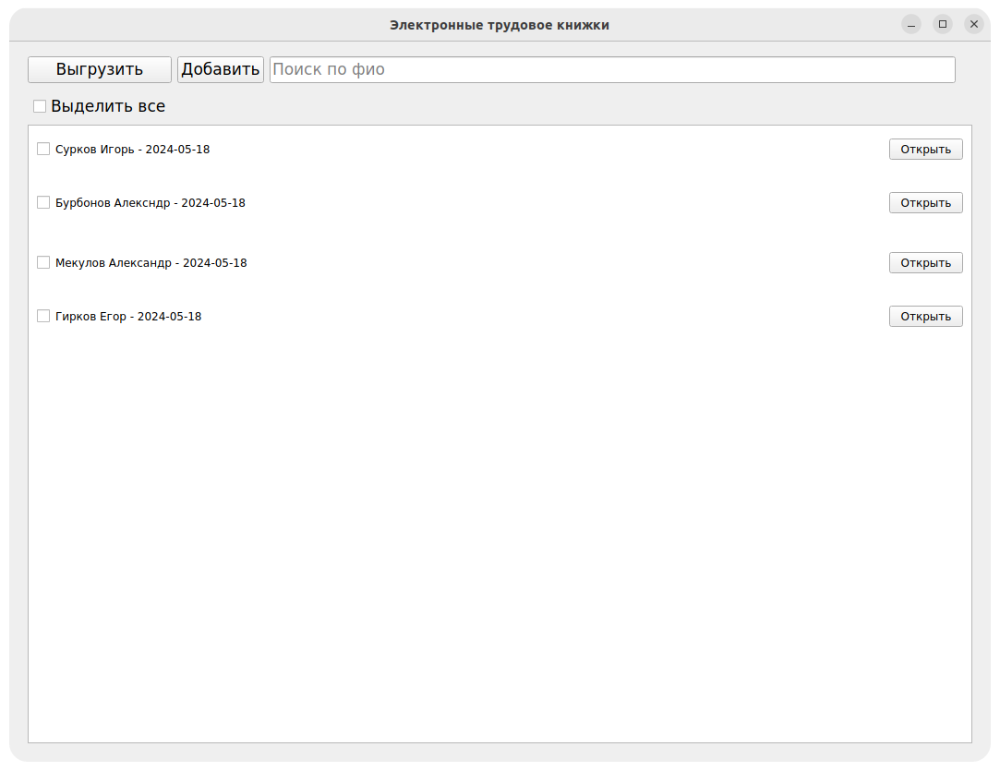
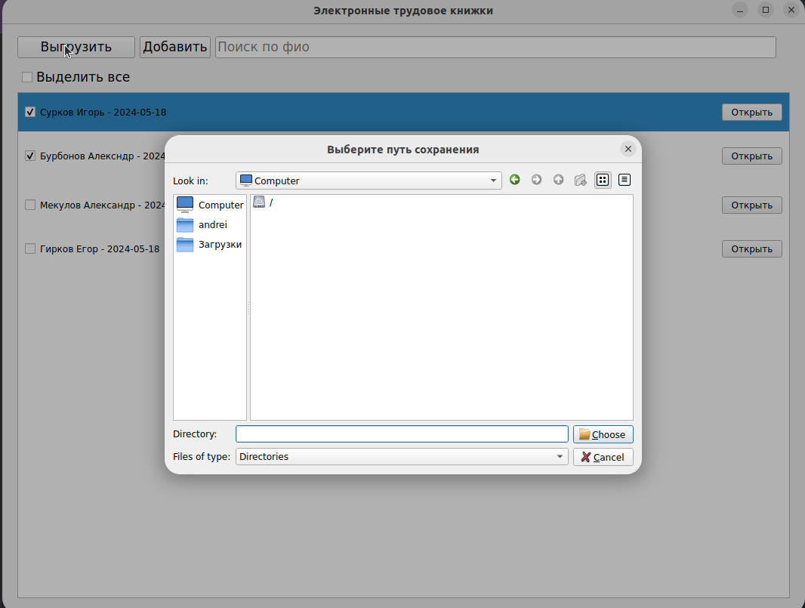
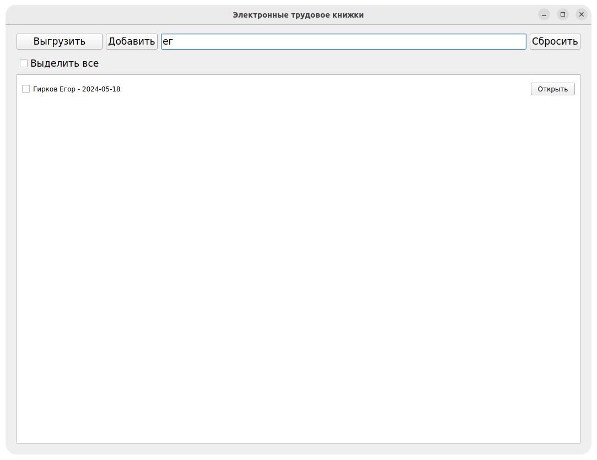
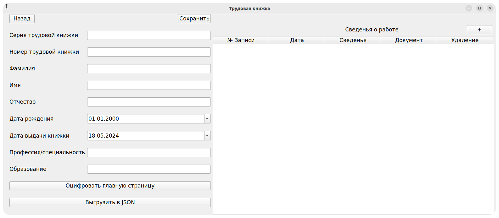
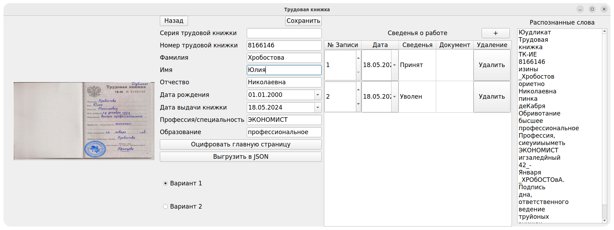
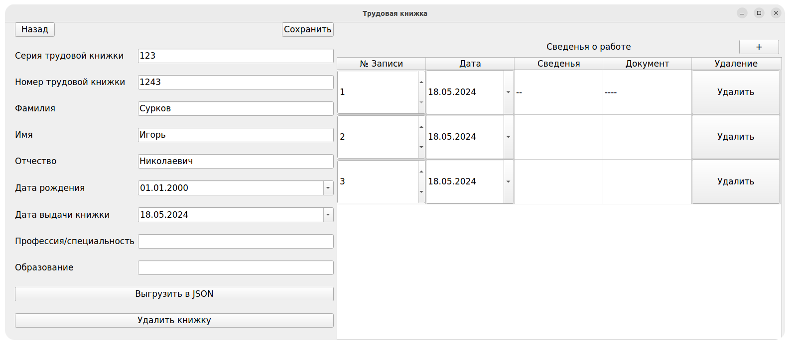

# Электронные трудовые книжки

## Описание системы

Система представляет собой приложение Qt, сервис API, разработанный на языке Python с использованием фреймворков Qt,
Flask платформы, предназначенной для разработки, развёртывания и запуска приложений в контейнерах - Docker. Система
включает в себя следующие компоненты:

Qt: Настольное приложение позволяет хранить трудовые книжки сотрудников, изменять их и выгружать в JSON, а также
сканировать титульные странички книжек и оцифровывать

Flask: API сервис имеет один метод и принимает в теле запроса изображение, после чего возвращает 2 варианта,
распознанного на изображении, текста

Docker: используется для контейнеризации приложения, что облегчает его развертывание и масштабирование.

Цель системы - оптимизация процесса заполнения трудовых книжек и ускорение приёма на работу.

## Запуск системы

Настольное приложение является самодостаточным и может запускаться через исполняемые файлы, однако без запущенного API
не сможет распознавать текст на фотографиях.

Перед запуском системы убедитесь, что на вашем компьютере установлены Docker и Docker Compose. Если они не установлены,
следуйте инструкциям на [официальном сайте Docker](https://www.docker.com/) для вашей операционной системы.

Для запуска система откройте терминал в папке [Api](Api) и запустите одну из команд:  
`docker compose up` или `docker-compose up`  
Начнется запуск API.

После запуска методы API будут доступны по адресу localhost:6543 (при условии, что конфигурация не была
изменена), а приложение автоматически будет подключатся для распознавания текста.

## Использование системы

При запуске исполняемого файла откроется окно со списком трудовых книжек, а также строка поиска, кнопка создания новой
книжки и кнопка выгрузки выбранных книжек.

Для выгрузки книжки или нескольких книжек в формате JSON нужно установить
флажки у нужных книжек и нажать на кнопку "Выгрузить".

Строка поиска автоматически включит сортировку при вводе ФИО,
после чего появится кнопка сброса.

В окне создания трудовой книжки можно вручную заполнить каждое поле и сразу выгрузить в JSON.

Также, можно выбрать скан титульной страницы для автоматического заполнения полей.

После сохранения книжка появится в общем списке, однако при необходимости ее можно не сохранять, а сразу выгрузить в
формате JSON и выйти на главный экран.

Каждую сохраненную трудовую книжку можно редактировать, выгрузить в формате JSON и удалить.

## Примеры

В
папке [Примеры трудовых книжек](%D0%9F%D1%80%D0%B8%D0%BC%D0%B5%D1%80%D1%8B%20%D1%82%D1%80%D1%83%D0%B4%D0%BE%D0%B2%D1%8B%D1%85%20%D0%BA%D0%BD%D0%B8%D0%B6%D0%B5%D0%BA)
вы можете найти фотографии, которые сможете отсканировать через наше приложение.